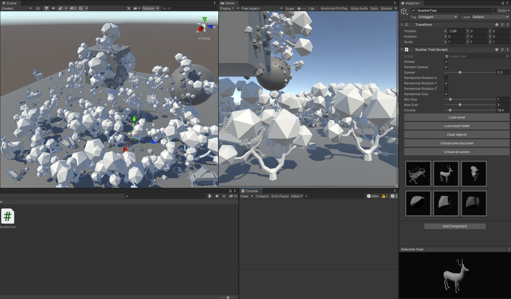
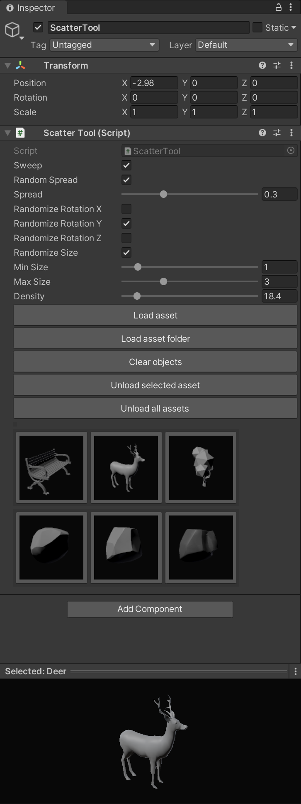

# Unity Editor Scatter Tool

## Editor tool for scattering objects to the scene.

## UI
- Object loading/unloading
- Object preview
- Scatter parameters:
    - Density
    - Spread
    - Randomization of rotation
    - Min/max size
- Clear scattered objects

## Instructions:

- ScatterTool needs to be selected in the hierarchy in order to use it
- Press "Load asset" to load any .obj or .fbx asset in the project
- Select object to scatter in the inpector
- Point and click with mouse in the scene window to scatter objects
- Enable "Sweep" for continous scatter when left click is held down

